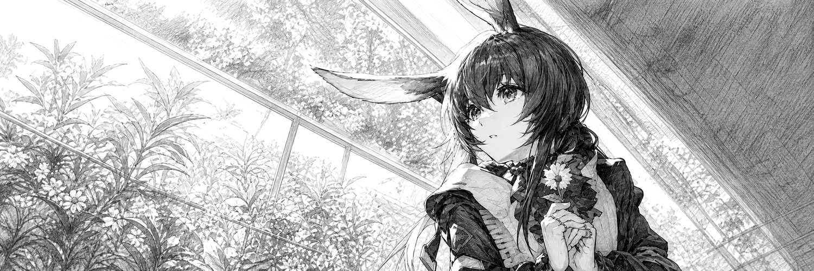

<picture>
  <source media="(prefers-color-scheme: dark)" srcset="assets/arknights-hero-dark.png">
  <source media="(prefers-color-scheme: light)" srcset="assets/arknights-hero-light.png">
  
</picture>

<h1 align="center">ARKNIGHTS PT-BR / PC + ANDROID</h1>

<strong>TRADUÇÃO COMUNITÁRIA / PREPARAÇÃO TÉCNICA / SEM BUILD PÚBLICA</strong>

  <code>v0.0.1-dev</code>
  <code>FASE 0/6</code>
  <code>PC PRIMEIRO</code>
  <code>ANDROID PLANEJADO</code>

---

## 01 / O PROJETO

Este repositório acompanha o desenvolvimento da minha **tradução comunitária de Arknights para português brasileiro**, planejada para **PC/Windows e Android**. A primeira implementação será feita e validada no PC; a adaptação para Android começará somente depois que a estrutura compartilhada de dados e o processo de atualização estiverem confirmados.

O projeto está na **fase de preparação**. O cliente ainda não foi inventariado, o catálogo ainda não foi extraído e nenhuma tradução ou build foi produzida. Por isso, o botão **Code → Download ZIP** baixa apenas a documentação e as imagens deste repositório — **não baixa o mod**.

> Não existe pacote público nesta fase. Qualquer arquivo de instalação será publicado exclusivamente em uma Release quando houver um candidato reproduzível, removível e suficientemente testado.

## 02 / ESTADO ATUAL

<table>
  <tr>
    <td width="180">
      <picture>
        <source media="(prefers-color-scheme: dark)" srcset="assets/arknights-icon-dark.png">
        <source media="(prefers-color-scheme: light)" srcset="assets/arknights-icon-light.png">
        
      </picture>
    </td>
    <td>
      <strong>FASE 0 DE 6 — PREPARAÇÃO</strong>  
      Plataformas-alvo: <strong>PC/Windows e Android</strong> 
      Prioridade inicial: <strong>PC</strong> 
      Catálogo extraído: <strong>não</strong> 
      Entradas traduzidas: <strong>0</strong> 
      Build pública: <strong>não existe</strong> 
      Compatibilidade confirmada: <strong>nenhuma versão ainda</strong>
    </td>
  </tr>
</table>

| Marco | Estado | Critério de conclusão |
|---|---|---|
| Preparação do projeto | Em andamento | Estrutura pública, regras e ambiente privado definidos |
| Mapeamento do cliente de PC | Pendente | Formatos, carregamento, fontes e atualização confirmados |
| Catálogo técnico | Pendente | Textos extraídos com IDs, marcações e duplicatas preservados |
| Tradução integral | Pendente | Todas as entradas traduzíveis cobertas e resíduos classificados |
| Build de PC | Pendente | Instalação, atualização e remoção reproduzíveis |
| Adaptação Android | Pendente | Pacote móvel validado sem depender da instalação de PC |

Consulte o [status técnico](docs/STATUS.md), o [roadmap](docs/ROADMAP.md) e a [estratégia de plataformas](docs/PLATAFORMAS.md).

## 03 / ESCOPO DA TRADUÇÃO

A meta é cobrir os textos acessíveis pelo mod: narrativa, eventos, interface, tutoriais, combate, itens, descrições e sistemas. IDs, placeholders, marcações funcionais, nomes próprios e elementos que devam permanecer no original serão preservados.

Este trabalho é apresentado como **tradução**, não como localização integral. A cobertura textual pode chegar a 100% antes de cada frase receber revisão manual contextual. Uma versão **1.0.0** ficará reservada para um estado no qual cobertura, revisão manual, consistência, formatação e validação no jogo estejam completas; não há data prometida para esse marco.

## 04 / PROCESSO

`MAPEAR → EXTRAIR → CLASSIFICAR → TRADUZIR → VALIDAR → TESTAR → EMPACOTAR`

O cliente será analisado primeiro em cópia de trabalho. A implementação definitiva só será escolhida depois que os formatos reais, o carregamento dos textos e a cadeia de atualização forem comprovados. O projeto não vai anunciar uma arquitetura especulativa como se já estivesse validada.

Princípios técnicos:

- alteração restrita ao necessário para exibir a tradução;
- instalação e remoção reversíveis;
- preservação de arquivos proprietários fora do repositório;
- validação de placeholders, marcações, codificação e estrutura;
- comportamento seguro diante de versões desconhecidas do cliente;
- atualização do mod sem apagar dados do jogador;
- teste de desempenho e regressão antes de cada publicação.

## 05 / AUTORIA E FERRAMENTAS

**Arknights PT-BR é um projeto criado, dirigido, mantido e validado por mim.** A definição do escopo, as decisões técnicas e editoriais, os testes, a compatibilidade e a publicação permanecem sob minha responsabilidade.

O **OpenAI Codex** integra o fluxo como ferramenta auxiliar para acelerar inventários, automações, tradução em escala, auditorias e documentação. Nesta fase, ele auxilia somente a preparação técnica e documental: **nenhum texto do jogo foi extraído ou traduzido ainda**. A origem das traduções e o estágio de revisão serão informados com clareza quando o catálogo existir.

Leia a atribuição completa em [Autoria e processo](docs/AUTORIA-E-PROCESSO.md).

## 06 / PUBLICAÇÃO E LIMITES

- Projeto comunitário, gratuito e sem monetização.
- Nenhum arquivo proprietário do jogo será incluído no repositório ou nos pacotes.
- Arknights, personagens, nomes e artes pertencem aos respectivos titulares.
- Este projeto não é uma tradução oficial e não representa endosso dos titulares do jogo.
- Cada Release informará plataformas, versão do cliente testada, instalação, atualização, remoção, limitações e integridade do pacote.
- As mudanças de cada versão ficarão nas Releases; esta página mostrará apenas o estado geral do projeto.

Sugestões de documentação e relatos técnicos podem ser enviados pelas [Issues](https://github.com/kacksdev/arknights-ptbr/issues). Pull requests não alteram o projeto automaticamente e só podem ser integrados pelo mantenedor.

---

<code>KACKS / COMMUNITY TRANSLATION / BRASIL</code>

